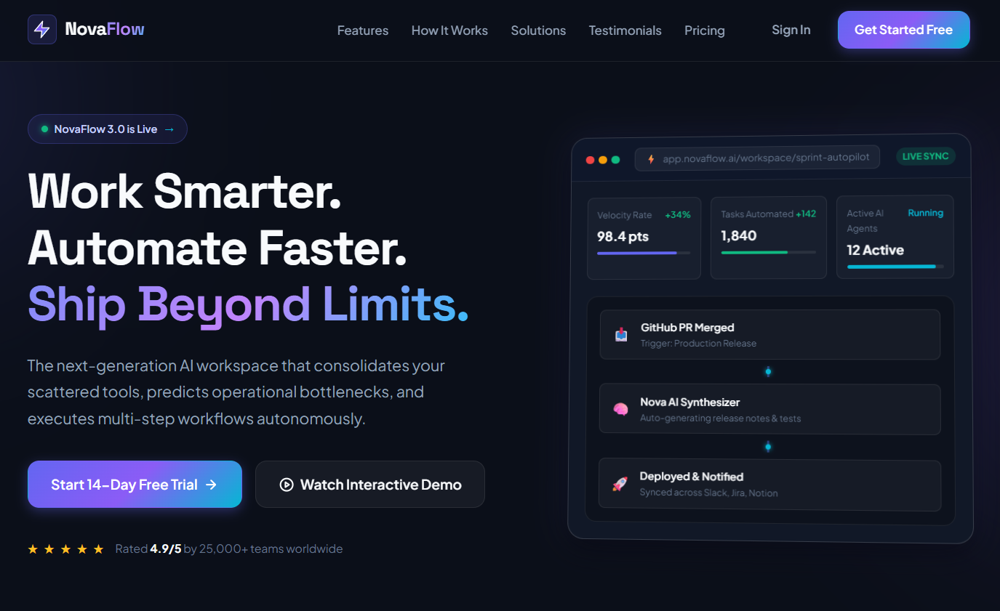
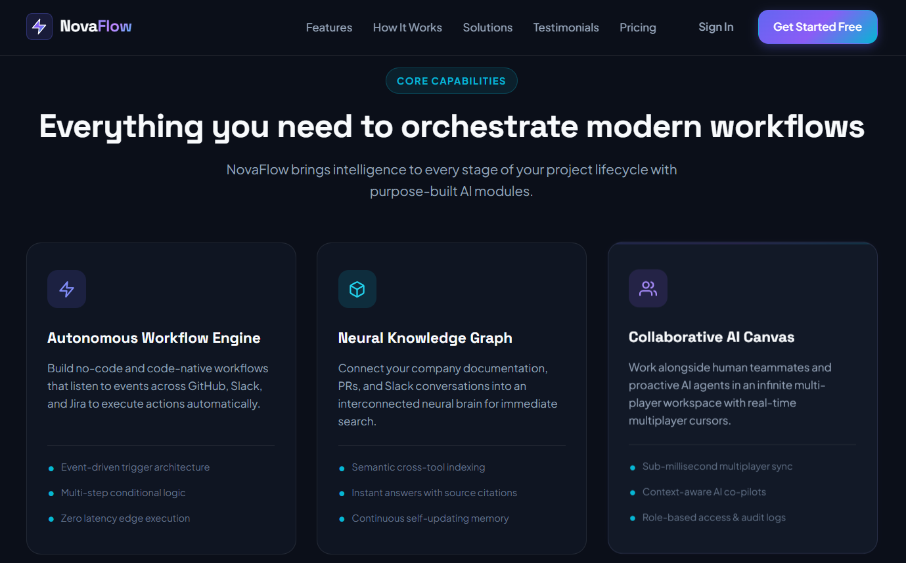
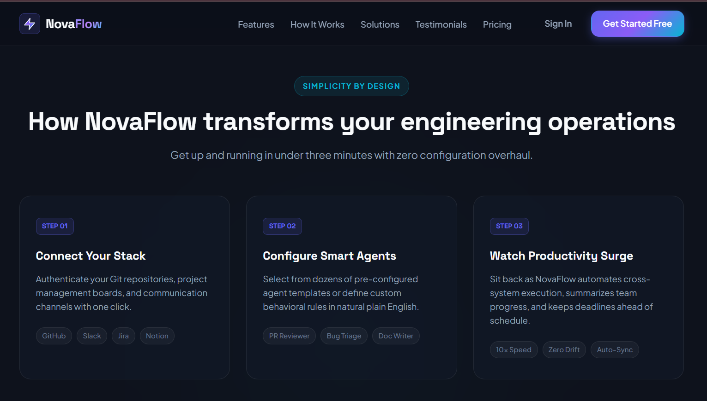
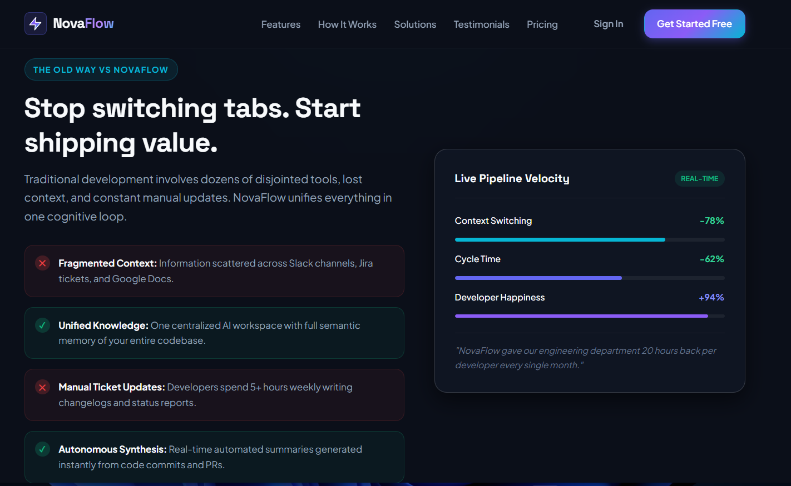
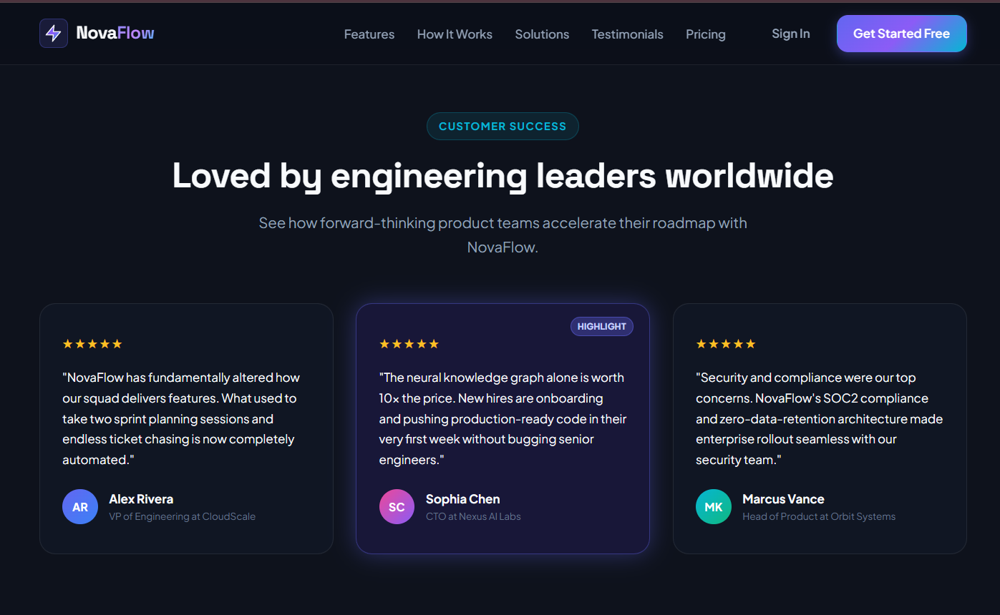
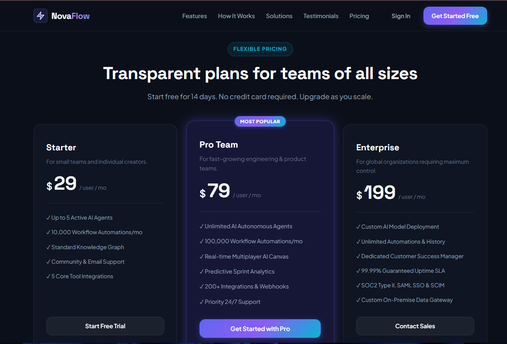
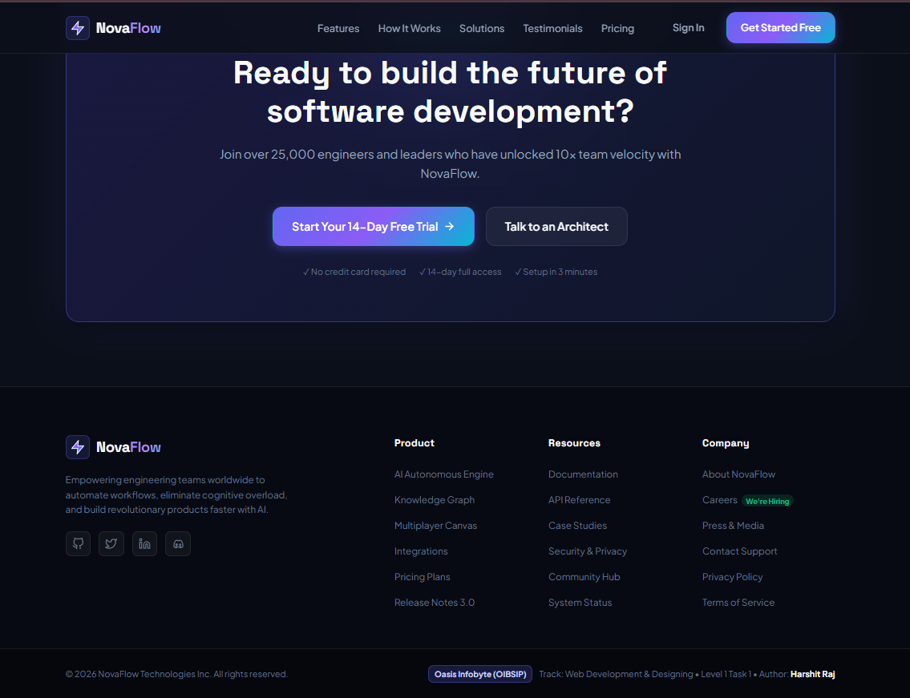

# NovaFlow — AI-Powered Productivity Platform

---

## 📌 Internship Information

- **Internship Program:** Oasis Infobyte Student Internship Program (OIBSIP)
- **Domain / Track:** Web Development & Designing
- **Level:** Level 1
- **Task:** Task 1 — Landing Page
- **Author / Intern:** Harshit Raj
- **Internship Organization:** Oasis Infobyte
- **Project Type:** Responsive SaaS Landing Page

---

## 📖 Project Overview

**NovaFlow** is a modern, high-conversion landing page designed for a fictional next-generation AI-powered workspace and workflow automation platform.

The landing page presents NovaFlow as an intelligent productivity platform that helps engineering and product teams automate workflows, reduce context switching, manage knowledge, and improve development productivity.

The project was developed from scratch using semantic HTML5 and modern CSS3 without relying on third-party CSS frameworks such as Bootstrap or Tailwind CSS.

The design focuses on:

- Modern SaaS aesthetics
- Responsive layouts
- Clean semantic HTML
- CSS Grid and Flexbox
- Gradient-based visual design
- Glassmorphism-inspired components
- Interactive hover effects
- Strong typography hierarchy
- Accessible and structured content

---

## 🎯 Objectives

The primary objectives of this project were:

- Create a professional and modern SaaS landing page.
- Build a visually engaging hero section.
- Implement responsive navigation and page layouts.
- Present product features through structured cards.
- Create a clear "How It Works" workflow.
- Showcase customer testimonials.
- Design a professional pricing section.
- Include a comparison/solutions section.
- Add strong Call-to-Action sections.
- Create a complete multi-column footer.
- Ensure responsiveness across desktop, tablet, and mobile screen sizes.
- Maintain clean and organized HTML5 and CSS3 code.

---

## ✨ Key Features

### 1. Sticky Navigation Bar

The landing page includes a modern navigation bar containing:

- NovaFlow brand logo
- Features
- How It Works
- Solutions
- Testimonials
- Pricing
- Sign In
- Get Started Free CTA

The navigation provides quick access to different sections of the landing page.

---

### 2. Hero Section

The hero section introduces NovaFlow with a strong product-focused headline:

> Work Smarter. Automate Faster. Ship Beyond Limits.

It includes:

- Product announcement badge
- Main product headline
- Supporting description
- Primary CTA
- Interactive demo CTA
- Social proof rating
- Product dashboard visualization

---

### 3. Core Capabilities

The Features section showcases the primary capabilities of NovaFlow.

Featured capabilities include:

- **Autonomous Workflow Engine**
- **Neural Knowledge Graph**
- **Collaborative AI Canvas**

Each feature card contains:

- Feature icon
- Feature title
- Description
- Supporting capabilities
- Modern card styling

---

### 4. How It Works

The workflow section explains the NovaFlow process through three simple steps:

#### Step 01 — Connect Your Stack

Connect repositories, project management platforms, and communication channels.

#### Step 02 — Configure Smart Agents

Configure pre-built AI agents or define custom behavioral rules.

#### Step 03 — Watch Productivity Surge

NovaFlow automates cross-system execution, summarizes progress, and keeps workflows synchronized.

---

### 5. Solutions / Comparison Section

The Solutions section demonstrates the difference between traditional development workflows and the NovaFlow approach.

It highlights problems such as:

- Fragmented Context
- Manual Ticket Updates
- Disconnected Development Tools

It also presents solutions such as:

- Unified Knowledge
- Autonomous Synthesis
- Centralized AI workspace

A live pipeline visualization is included to demonstrate productivity improvements.

---

### 6. Customer Testimonials

The Testimonials section showcases customer feedback using professionally styled testimonial cards.

The section includes:

- Customer ratings
- Customer names
- Job titles
- Company names
- Highlighted testimonial card
- Modern avatar elements

---

### 7. Pricing Section

NovaFlow includes three pricing tiers:

| Plan | Price | Target Users |
|------|------:|--------------|
| Starter | $29 / user / month | Small teams & individual creators |
| Pro Team | $79 / user / month | Growing engineering & product teams |
| Enterprise | $199 / user / month | Large organizations |

The **Pro Team** plan is highlighted as the most popular option.

---

### 8. Final Call-to-Action

The final CTA encourages users to start using NovaFlow with:

- 14-day free trial
- Talk to an Architect option
- No credit card requirement
- Full access during trial
- Quick setup messaging

---

### 9. Comprehensive Footer

The footer contains:

- NovaFlow brand information
- Product links
- Resources
- Company links
- Social media icons
- Privacy and terms links
- Copyright information
- OIBSIP internship attribution
- Author information

---

# 📸 Project Screenshots

The following screenshots showcase the major sections of the NovaFlow landing page.

---

## 🏠 Home / Hero Section

The hero section introduces NovaFlow with the main product headline, CTA buttons, product dashboard visualization, and social proof.

---

## ⚡ Features / Core Capabilities

The Features section presents the core AI-powered capabilities of the NovaFlow platform.

---

## ⚙️ How It Works

The How It Works section explains the three-step workflow for connecting tools, configuring smart agents, and improving productivity.

---

## 🔄 Solutions / Comparison

The Solutions section compares traditional fragmented workflows with NovaFlow's unified workflow approach.

---

## 💬 Customer Testimonials

The Testimonials section presents customer reviews and social proof from engineering and product leaders.

---

## 💳 Pricing

The Pricing section presents Starter, Pro Team, and Enterprise subscription plans.

---

## 📌 Footer

The footer contains product navigation, resources, company information, social links, and internship attribution.

---

# 🛠️ Technologies Used

### Frontend

- **HTML5**
- **CSS3**

### HTML5 Concepts

- Semantic HTML
- Header
- Navigation
- Main
- Section
- Article
- Footer
- Figure
- Accessible markup

### CSS3 Concepts

- CSS Variables
- Flexbox
- CSS Grid
- Media Queries
- Responsive Typography
- `clamp()`
- CSS Gradients
- CSS Animations
- Hover Effects
- Glassmorphism
- Responsive Layouts
- Custom Components

### Fonts

- Plus Jakarta Sans
- Space Grotesk

### Icons & Graphics

- Inline SVG icons
- CSS-based visual elements
- Gradient UI components

### Frameworks

**No CSS frameworks were used.**

The project was developed using pure HTML5 and CSS3.

---
## 👨‍💻 Author

**Harshit Raj**  
B.Tech Computer Science & Engineering Student | Aspiring Software Developer

Developed as part of the **Oasis Infobyte Student Internship Program (OIBSIP)** under the **Web Development & Designing — Level 1, Task 1**.

This landing page was designed and developed using **pure HTML5 and CSS3**, focusing on responsive design, modern UI, CSS Grid, Flexbox, animations, and a professional SaaS-style interface.

**Internship:** Oasis Infobyte Student Internship Program (OIBSIP)  
**Track:** Web Development & Designing  
**Level:** 1  
**Task:** Task 1 — Landing Page  
**Project:** NovaFlow — AI-Powered Productivity Platform

### 🔗 Connect

- **GitHub:** [harshitraj7304](https://github.com/harshitraj7304)
- **LinkedIn:** [Harshit Raj](https://www.linkedin.com/in/harshit-raj-35a657229)
