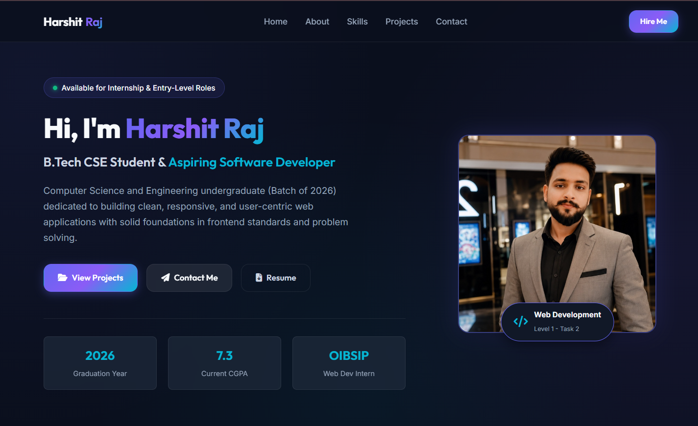
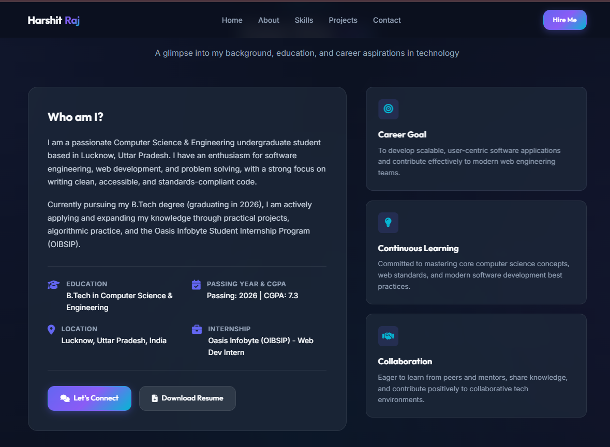
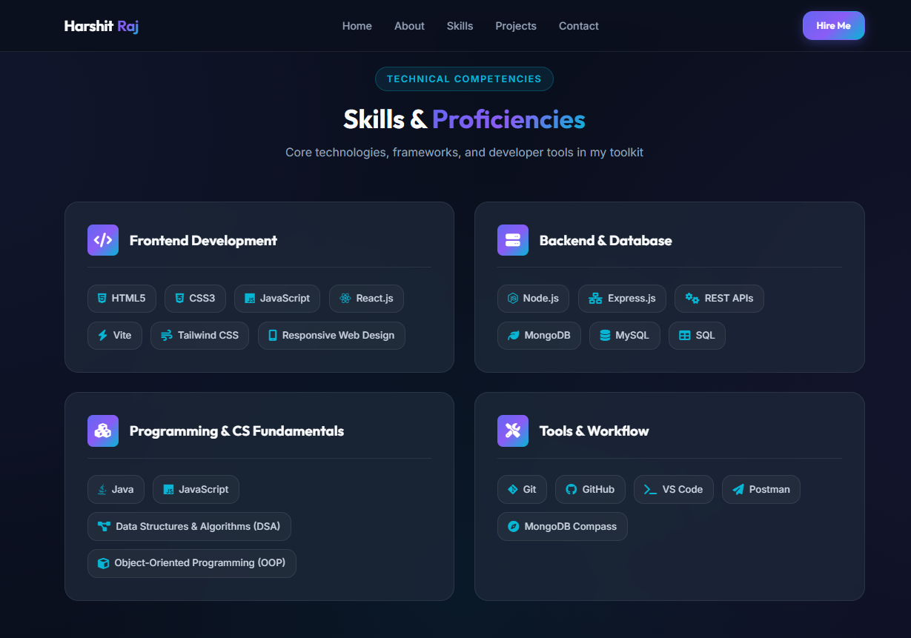
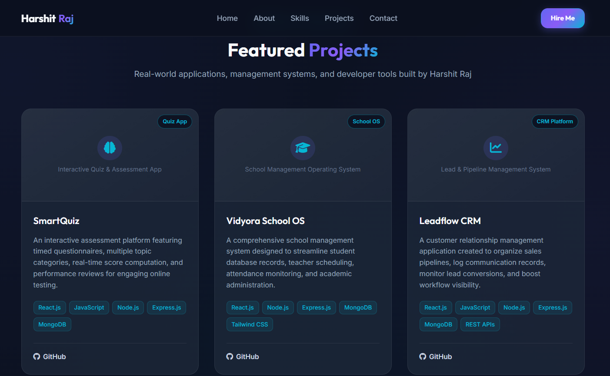
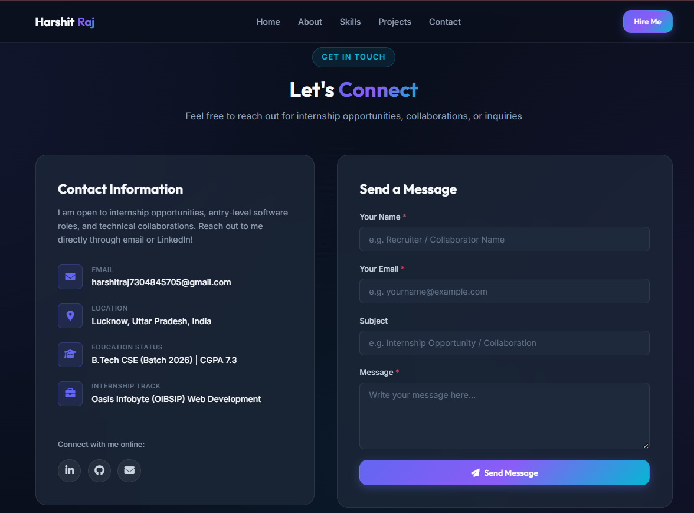

# Harshit Raj — Personal Portfolio


A responsive personal portfolio website developed as part of the **Oasis Infobyte Student Internship Program (OIBSIP)** — Web Development & Designing track.

---

## 📌 Internship Information

- **Internship Program:** Oasis Infobyte Student Internship Program (OIBSIP)
- **Domain:** Web Development & Designing
- **Level:** Level 1
- **Task:** Task 2 — Personal Portfolio
- **Intern:** Harshit Raj
- **Passing Year:** 2026
- **Current CGPA:** 7.3

---

## 👨‍💻 About Me

I am a passionate Computer Science & Engineering undergraduate student based in Lucknow, Uttar Pradesh.

I am interested in software development, web development, problem solving, and building clean, responsive, and user-centric web applications.

Currently pursuing my B.Tech in Computer Science & Engineering, I am continuously improving my technical skills through practical projects, programming practice, and internship experience.

---

## 🎯 Portfolio Highlights

The portfolio website includes:

- Responsive navigation
- Personal introduction
- Education information
- Career goals
- Technical skills
- Programming and CS fundamentals
- Developer tools and workflow
- Featured projects
- Contact information
- GitHub and LinkedIn links
- Resume download section
- Responsive design for different screen sizes
- Personal profile photograph

---

## 🛠️ Technologies Used

### Frontend

- HTML5
- CSS3
- JavaScript

### Web Design

- Responsive Web Design
- CSS Flexbox
- CSS Grid
- Modern UI styling
- Semantic HTML

### Development Tools

- Git
- GitHub
- Visual Studio Code

---

## 🚀 Featured Projects

### 1. SmartQuiz

An interactive quiz and assessment application featuring timed questionnaires, multiple topic categories, score computation, and performance-oriented testing features.

**Technologies:**

- React.js
- JavaScript
- Node.js
- Express.js
- MongoDB

🔗 [GitHub Repository](https://github.com/harshitraj7304/smartquiz)

---

### 2. Vidyora School OS

A school management system designed to streamline student records, teacher scheduling, attendance monitoring, and academic administration.

**Technologies:**

- React.js
- Node.js
- Express.js
- MongoDB
- Tailwind CSS

🔗 [GitHub Repository](https://github.com/harshitraj7304/vidyora-school-os)

---

### 3. Leadflow CRM

A customer relationship management application focused on organizing sales pipelines, communication records, lead conversions, and workflow visibility.

**Technologies:**

- React.js
- JavaScript
- Node.js
- Express.js
- MongoDB
- REST APIs

🔗 [GitHub Repository](https://github.com/harshitraj7304/leadflow-crm)

---

## 📸 Portfolio Screenshots

### 🏠 Home



### 👤 About



### 🛠️ Skills



### 💻 Projects



### 📩 Contact



---

## 📂 Project Structure

```text
WebDev-L1-Portfolio/
│
├── assets/
│   └── profile images and other assets
│
├── screenshots/
│   ├── Home.png
│   ├── About.png
│   ├── Skills.png
│   ├── Projects.png
│   └── Contact.png
│
├── index.html
├── style.css
└── README.md