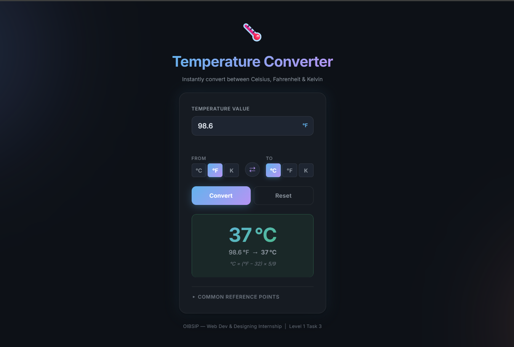

# 🌡️ Temperature Converter — Web Utility


---

## 📌 Internship Information

- **Internship Program:** Oasis Infobyte Student Internship Program (OIBSIP)
- **Domain / Track:** Web Development & Designing
- **Level:** Level 1
- **Task:** Task 3 — Temperature Converter
- **Author / Intern:** Harshit Raj

---

## 📖 Project Overview

**Temperature Converter** is a responsive web utility application developed as part of the **Oasis Infobyte Student Internship Program (OIBSIP) — Level 1, Task 3**.

The application allows users to convert temperature values between **Celsius, Fahrenheit, and Kelvin** through a clean, intuitive, and responsive interface.

The project focuses on accurate temperature conversion, user-friendly controls, input validation, responsive design, and interactive functionality using the required web technologies.

---

## 🎯 Objectives

- Build a functional temperature conversion web application.
- Implement accurate temperature conversion formulas.
- Support Celsius, Fahrenheit, and Kelvin temperature units.
- Allow users to select source and target temperature units.
- Provide a simple and intuitive user interface.
- Implement proper input validation.
- Handle invalid and physically impossible temperature values.
- Create a responsive design for desktop, tablet, and mobile devices.
- Practice DOM manipulation and event handling using JavaScript.
- Use semantic HTML5 and modern CSS3 techniques.
- Maintain a clean separation between HTML, CSS, and JavaScript.

---

## 🛠️ Technologies Used

### HTML5

HTML5 is used to create the semantic structure of the application, including:

- Semantic webpage structure
- Input controls
- Buttons
- Labels
- Result sections
- Accessible form elements

### CSS3

CSS3 is used to create the complete visual design and responsive layout, including:

- CSS Variables
- Flexbox
- Responsive layouts
- Gradients
- Borders and shadows
- Hover effects
- Focus states
- Media queries
- Modern dark-themed UI
- Responsive typography

### JavaScript — Vanilla

Vanilla JavaScript is used to implement the application's functionality, including:

- DOM manipulation
- Event handling
- Temperature conversion calculations
- Input validation
- Dynamic result updates
- Unit selection
- Unit swapping
- Reset functionality

### Frameworks & Libraries

**None.**

The project is built using only:

**HTML5 + CSS3 + Vanilla JavaScript**

No React, Bootstrap, Tailwind CSS, jQuery, or other JavaScript/CSS frameworks are used.

---

## ✨ Key Features

- 🌡️ Celsius temperature conversion
- 🌡️ Fahrenheit temperature conversion
- 🌡️ Kelvin temperature conversion
- 🔄 Source and target unit selection
- ↔️ Unit swap functionality
- 🧮 Accurate conversion calculations
- ⚠️ Input validation
- 🚫 Absolute-zero validation for Kelvin
- 🔁 Reset functionality
- 📱 Fully responsive interface
- 🎨 Modern dark-themed UI
- ✨ Interactive controls
- 📊 Clear conversion result display
- 📐 Conversion formula display
- 📌 Common temperature reference points
- ♿ Keyboard-friendly controls

---

## 🔢 Supported Conversions

The application supports conversion between the following temperature units:

- Celsius → Fahrenheit
- Fahrenheit → Celsius
- Celsius → Kelvin
- Kelvin → Celsius
- Fahrenheit → Kelvin
- Kelvin → Fahrenheit

Same-unit conversions are also handled appropriately.

### Conversion Formulas

#### Celsius → Fahrenheit

```text
°F = (°C × 9/5) + 32
```

#### Fahrenheit → Celsius

```text
°C = (°F − 32) × 5/9
```

#### Celsius → Kelvin

```text
K = °C + 273.15
```

#### Kelvin → Celsius

```text
°C = K − 273.15
```

#### Fahrenheit → Kelvin

```text
K = (°F − 32) × 5/9 + 273.15
```

#### Kelvin → Fahrenheit

```text
°F = (K − 273.15) × 9/5 + 32
```

---

## 🖼️ Project Screenshot

### Temperature Converter Interface



> The screenshot above demonstrates the completed Temperature Converter interface, including the temperature input, unit selection controls, conversion result, and responsive modern UI.

---

## 💻 User Interface

The application provides a focused temperature conversion interface containing:

- Temperature input field
- Source unit selector
- Target unit selector
- Unit swap button
- Convert button
- Reset button
- Conversion result card
- Conversion formula
- Common temperature reference points

The interface uses a modern dark visual theme with gradient accents, clean spacing, rounded components, and responsive design.

---

## 📱 Responsive Design

The application is designed to provide a consistent user experience across:

| Device | Support |
|---|---|
| Desktop | ✅ |
| Laptop | ✅ |
| Tablet | ✅ |
| Mobile | ✅ |

The layout automatically adapts to different screen sizes using CSS3 responsive techniques and media queries.

---

## ⚠️ Input Validation

The application validates user input before performing calculations.

It handles:

- Empty input
- Invalid numerical input
- Invalid temperature values
- Temperatures below absolute zero
- Incorrect or incomplete input

For Kelvin-based temperatures, values below **0 K** are rejected because they represent physically invalid temperatures.

---

## 🔄 Reset Functionality

The **Reset** button allows users to quickly restore the converter to its initial state.

It resets the relevant:

- Temperature input
- Selected units
- Conversion result
- Validation state

This makes it easy to perform a new conversion without manually clearing the interface.

---

## 🚀 How to Run the Project

### Option 1 — Direct Browser

1. Open the project folder.
2. Locate `index.html`.
3. Double-click `index.html`.
4. The Temperature Converter will open in your default browser.

### Option 2 — VS Code Live Server

1. Open the project in Visual Studio Code.
2. Install the **Live Server** extension.
3. Right-click `index.html`.
4. Select **Open with Live Server**.
5. The application will open in your browser.

### Option 3 — Python HTTP Server

If Python is installed, open a terminal in the project directory and run:

```bash
python -m http.server 8000
```

Then open:

```text
http://localhost:8000
```

---

## 📋 OIBSIP Requirement Verification

- [x] Temperature Converter Web Application
- [x] HTML5 used for structure
- [x] CSS3 used for styling
- [x] JavaScript (Vanilla) used for functionality
- [x] Celsius conversion implemented
- [x] Fahrenheit conversion implemented
- [x] Kelvin conversion implemented
- [x] Source unit selection
- [x] Target unit selection
- [x] Unit swap functionality
- [x] Accurate conversion calculations
- [x] Input validation
- [x] Kelvin absolute-zero validation
- [x] Reset functionality
- [x] Responsive design
- [x] Modern user interface
- [x] Interactive controls
- [x] Conversion formula display
- [x] No JavaScript framework
- [x] No CSS framework
- [x] No external UI library
- [x] Separate HTML, CSS, and JavaScript implementation
- [x] Tested in a modern web browser

---

## 👨‍💻 Author

### Harshit Raj

**B.Tech Computer Science & Engineering Student | Aspiring Software Developer**

I am a Computer Science & Engineering undergraduate with an interest in software development, web development, problem solving, and building practical web applications.

This project was designed and developed as part of the **Oasis Infobyte Student Internship Program (OIBSIP)** under the **Web Development & Designing — Level 1, Task 3**.

Through this project, I implemented a functional temperature conversion utility using **HTML5, CSS3, and Vanilla JavaScript**, with a focus on responsive design, clean UI, usability, accessibility, and accurate JavaScript-based calculations.

### 🎓 Academic Profile

- **Degree:** B.Tech — Computer Science & Engineering
- **Graduation Year:** 2026
- **Current CGPA:** 7.3
- **Location:** Lucknow, Uttar Pradesh, India

### 💼 Internship Details

- **Organization:** Oasis Infobyte
- **Program:** Oasis Infobyte Student Internship Program (OIBSIP)
- **Domain:** Web Development & Designing
- **Level:** Level 1
- **Task:** Task 3 — Temperature Converter
- **Project Type:** Responsive Web Utility

### 🧑‍💻 Technical Focus

- HTML5
- CSS3
- JavaScript
- Responsive Web Design
- DOM Manipulation
- Git & GitHub
- Web Development

### 🔗 Connect With Me

- **GitHub:** [harshitraj7304](https://github.com/harshitraj7304)
- **LinkedIn:** [Harshit Raj](https://www.linkedin.com/in/harshit-raj-35a657229)

---

## 🏆 OIBSIP Internship Submission

**Oasis Infobyte Student Internship Program**

**Web Development & Designing — Level 1 — Task 3**

### Project

**Temperature Converter — Web Utility**

### Technology Stack

**HTML5 • CSS3 • Vanilla JavaScript**

---

**© 2026 Harshit Raj. All Rights Reserved.**